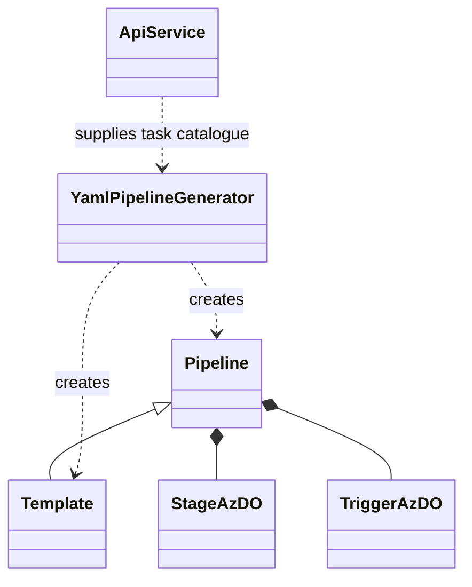

# CasCap.Api.AzureDevOps

Azure DevOps helper library used by the [yamlizr](https://github.com/f2calv/yamlizr) global tool. It
reads classic Designer Build and Release Definitions through the Azure DevOps REST API and converts
them into Azure Pipelines YAML objects.

## Purpose

The library owns everything that is not command line presentation:

- an Azure DevOps REST client for the endpoints the official .NET client libraries do not cover
- models for the Azure DevOps task/extension catalogue
- models for the subset of the Azure Pipelines YAML schema that this tool emits
- the generator that maps a classic definition onto those YAML models

## Services

| Type | Purpose |
| --- | --- |
| `IApiService` / `ApiService` | Retrieves the installed extension catalogue for an organisation and validates generated YAML against the preview-run endpoint. |

## Utilities

| Type | Purpose |
| --- | --- |
| `YamlPipelineGenerator` | Converts a `BuildDefinition` **or** a `ReleaseDefinition` into a `Pipeline`, and reports what it could not convert through `Warnings`. |
| `LiteralMultilineEventEmitter` | YamlDotNet event emitter which renders multi-line strings as literal block scalars rather than escaped single lines. |

`YamlPipelineGenerator.Warnings` is the library's contract for conversion fidelity: any classic
construct that cannot be represented is recorded there rather than dropped silently. Callers are
expected to surface it. See [issue #182](https://github.com/f2calv/yamlizr/issues/182).

## Configuration

`AzureDevOpsOptions` binds the `CasCap:AzureDevOpsOptions` section.

| Property | Purpose |
| --- | --- |
| `PAT` | Personal Access Token, or an access token issued to a pipeline's build service identity. |
| `OrganisationUri` | Absolute Uri of the Azure DevOps organisation. |
| `Project` | Name of the team project to convert. |

## Class Hierarchy

## Dependencies

| NuGet package | Purpose |
| --- | --- |
| `AzurePipelinesToGitHubActionsConverter.Core` | Azure Pipelines YAML schema types and the GitHub Actions conversion. |
| `CasCap.Common.Extensions` | Shared collection and string helpers. |
| `CasCap.Common.Net` | `HttpClientBase`, the REST client base type. |
| `Microsoft.TeamFoundation.DistributedTask.WebApi` | Task group and variable group clients. |
| `Microsoft.TeamFoundationServer.Client` | Build definition client. |
| `Microsoft.VisualStudio.Services.Client` | Connection and credential types. |
| `Microsoft.VisualStudio.Services.Release.Client` | Release definition client. |
| `Newtonsoft.Json` | Required by the Azure DevOps client libraries. |
| `semver` | Parses classic task version specs such as `2.*`. |
| `YamlDotNet` | YAML serialization. |

| Project reference | Configuration |
| --- | --- |
| `CasCap.Common.Extensions`, `CasCap.Common.Net` | Referenced as projects in `Debug`, as packages in `Release`. |
