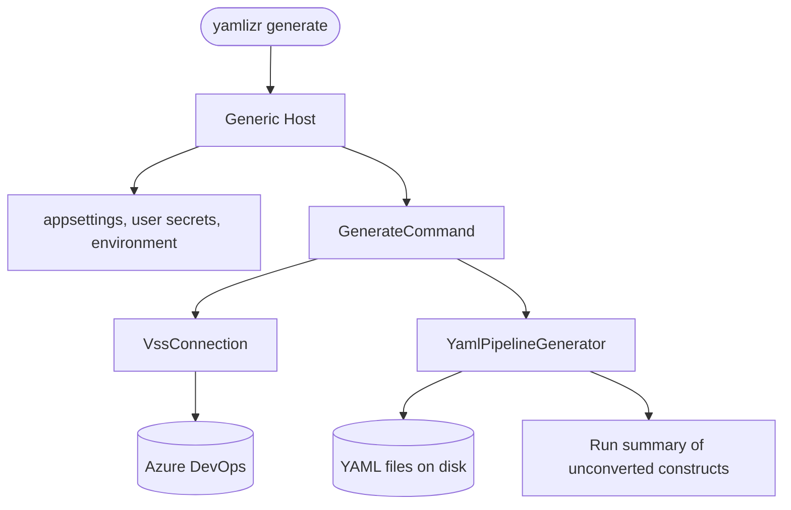

# CasCap.DevOpsYamlizrCli

The `yamlizr` .NET global tool and container image. Converts Azure DevOps Classic Designer Build and
Release Definitions, and any Task Groups they reference, into Azure Pipelines YAML or GitHub Actions
workflows.

For installation and usage see the [repository README](../../README.md).

## Purpose

This project owns the command surface, console presentation and orchestration only. Everything that
understands Azure DevOps or YAML lives in `CasCap.Api.AzureDevOps`.

## Commands

| Command | Purpose |
| --- | --- |
| `generate` | Retrieves every classic definition in a project and writes the converted YAML to disk. |

`CommandBase` holds the shared Azure DevOps connection, the typed clients and the progress bar
options. It reports authentication and project lookup failures through `ILogger<T>` and an actionable
console message rather than swallowing them.

## Configuration

Configuration is layered, with a command line option always winning over a configured value:

1. `appsettings.json` next to the tool
2. `appsettings.json` in the current working directory
3. .NET User Secrets
4. environment variables

The bindable shape is `CasCap:AzureDevOpsOptions`, see
[AzureDevOpsOptions](../CasCap.Api.AzureDevOps/README.md#configuration).

## Service Architecture

## Dependencies

| NuGet package | Purpose |
| --- | --- |
| `Figgle`, `Figgle.Fonts` | ASCII banner. |
| `McMaster.Extensions.CommandLineUtils` | Command and option parsing. |
| `McMaster.Extensions.Hosting.CommandLine` | Runs the command line application on the generic host. |
| `Microsoft.Extensions.Configuration.UserSecrets` | Local credential storage. |
| `Microsoft.Extensions.Hosting` | Configuration, logging and dependency injection. |
| `ShellProgressBar` | Progress reporting. |

| Project reference | Purpose |
| --- | --- |
| `CasCap.Api.AzureDevOps` | Azure DevOps access, pipeline models and the YAML generator. |
